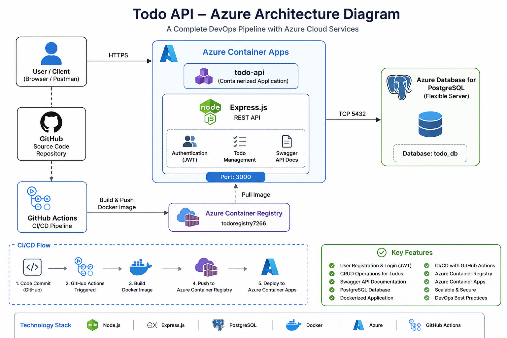
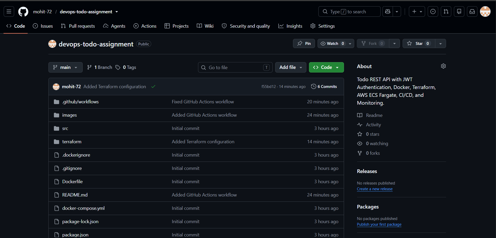
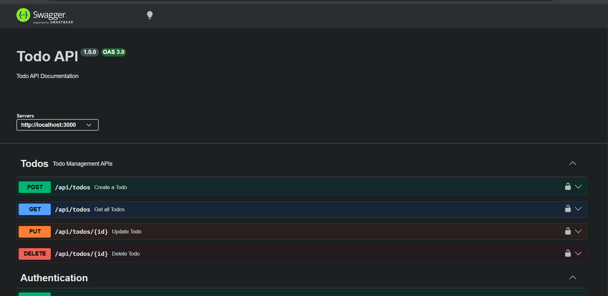
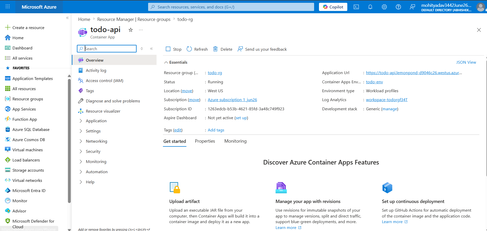
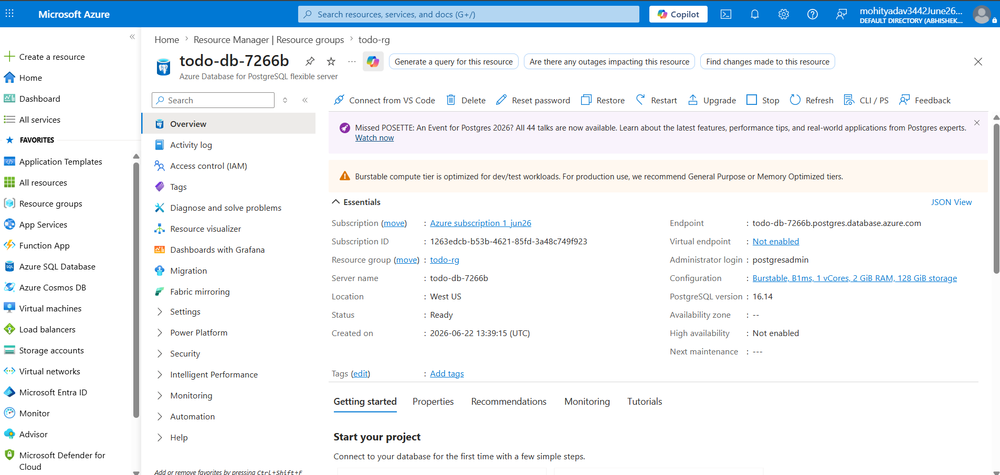
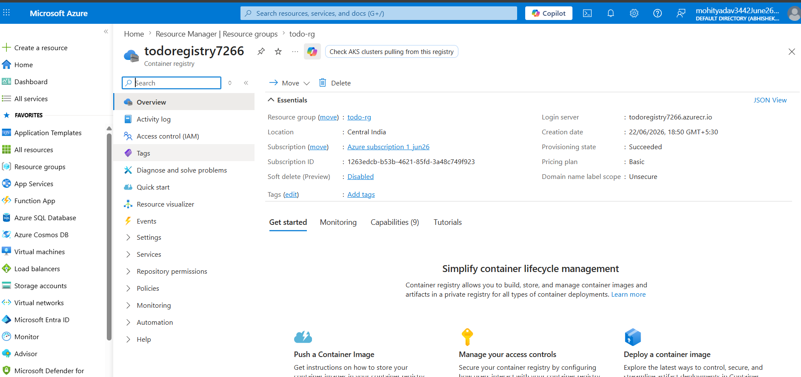

# 🚀 DevOps Todo Assignment


A production-ready **Todo REST API** built with **Node.js**, **Express**, **PostgreSQL**, **Docker**, and deployed on **Microsoft Azure Container Apps**.

---

# 📌 Project Overview

This project demonstrates a complete DevOps workflow by:

- Building a REST API
- Containerizing the application using Docker
- Running locally with Docker Compose
- Storing Docker images in Azure Container Registry (ACR)
- Using Azure PostgreSQL Flexible Server
- Deploying the application on Azure Container Apps
- Managing the source code with Git & GitHub

---

# 🛠 Tech Stack

| Technology | Purpose |
|------------|---------|
| Node.js | Backend Runtime |
| Express.js | REST API |
| PostgreSQL | Database |
| Sequelize | ORM |
| JWT | Authentication |
| Swagger | API Documentation |
| Docker | Containerization |
| Docker Compose | Local Development |
| Azure Container Registry | Docker Image Registry |
| Azure PostgreSQL | Managed Database |
| Azure Container Apps | Cloud Deployment |
| Git & GitHub | Version Control |

---

# ✨ Features

- User Registration
- User Login (JWT Authentication)
- Create Todo
- Get Todos
- Update Todo
- Delete Todo
- Swagger API Documentation
- Dockerized Application
- Azure Cloud Deployment

---

# 📂 Project Structure

```
todo-api-task
│
├── src
│   ├── config
│   ├── controllers
│   ├── docs
│   ├── middleware
│   ├── models
│   ├── routes
│   └── app.js
│
├── Dockerfile
├── docker-compose.yml
├── package.json
├── README.md
└── .gitignore
```

---

# ⚙ Local Setup

Clone the repository

```bash
git clone https://github.com/mohit-72/devops-todo-assignment.git
```

Go to project

```bash
cd devops-todo-assignment
```

Install dependencies

```bash
npm install
```

Run project

```bash
npm start
```

---

# 🐳 Docker

Build

```bash
docker build -t todo-api .
```

Run

```bash
docker run -p 3000:3000 todo-api
```

Docker Compose

```bash
docker compose up --build
```

---

# ☁ Azure Deployment

## Azure Resources

| Resource | Name |
|----------|------|
| Resource Group | todo-rg |
| Azure Container Registry | todoregistry7266 |
| Azure PostgreSQL | todo-db-7266b |
| Azure Container App | todo-api |

---

# 🌐 Live Application

Application

```
https://todo-api.lemonpond-d9046c26.westus.azurecontainerapps.io
```

Swagger

```
https://todo-api.lemonpond-d9046c26.westus.azurecontainerapps.io/api-docs
```

---

# 📖 API Endpoints

## Authentication

| Method | Endpoint |
|---------|----------|
| POST | /api/auth/register |
| POST | /api/auth/login |

## Todos

| Method | Endpoint |
|---------|----------|
| GET | /api/todos |
| POST | /api/todos |
| PUT | /api/todos/:id |
| DELETE | /api/todos/:id |

---

# 📷 Screenshots

## Swagger UI

> Add screenshot here

```
images/swagger.png
```

---

## Azure Container App

> Add screenshot here

```
images/container-app.png
```

---

## Azure PostgreSQL

> Add screenshot here

```
images/postgres.png
```

---

## Azure Container Registry

> Add screenshot here

```
images/acr.png
```

---

## GitHub Repository

> Add screenshot here

```
images/github.png
```

---

# # 🏗 Architecture



```
               GitHub
                  │
                  │
                  ▼
          Source Code Repository
                  │
                  ▼
            Docker Build
                  │
                  ▼
      Azure Container Registry
                  │
                  ▼
      Azure Container Apps
                  │
                  ▼
       Express REST API
                  │
                  ▼
 Azure PostgreSQL Flexible Server
```

---

# 🔐 Environment Variables

```
PORT=3000

DB_HOST=xxxxxxxx.postgres.database.azure.com

DB_PORT=5432

DB_NAME=todo_db

DB_USER=postgresadmin

DB_PASSWORD=********

JWT_SECRET=********
```

---

# 📈 Future Improvements

- GitHub Actions CI/CD
- Unit Testing
- Kubernetes Deployment
- Monitoring with Azure Monitor
- HTTPS Custom Domain

---

---

# 📸 Project Screenshots

## 🏗️ Architecture


## 💻 GitHub Repository



## 📖 Swagger UI



## ☁️ Azure Container App



## 🗄️ Azure PostgreSQL



## 📦 Azure Container Registry




# 👨‍💻 Author

**Mohit Yadav**

GitHub:

https://github.com/mohit-72

---

# ⭐ If you like this project

Give this repository a ⭐ on GitHub.